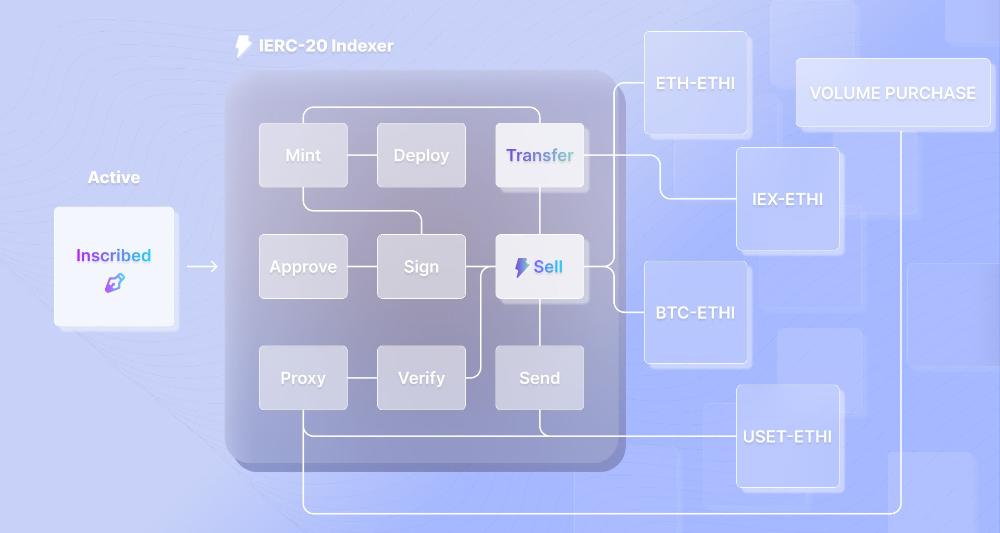

# IERC Protocols

🌐 IERC20 Market: https://ierc20.com

## Introduction
IERC is an Ethernet-based protocol extension ecosystem designed to leverage the Ethernet foundation to create a more open and cheaper token inscription ecosystem.

IERC defines a set of open protocols for token inscription. This protocol enables perfect implementation of token definitions in the underlying Ethernet ecosystem and is widely used in the market. Here are some of the key features:

**Standardization**: IERC provides a standard set of protocol definitions that allow different tokens to interoperate with each other, facilitating future integration into various applications and wallets.

**Transparency**: The supply, ownership and transactions of each token are completely transparent and can be tracked on the blockchain. Different indexing parties can also organize the same user information based on the information on the chain.

**Customization**: IERC20 tokens allow developers to customize their properties and functionality to suit different use cases and business needs.

## [IERC20](protocol/IERC20.md)

⏰ Open Source Time:  2023-06-20

IERC20 not only defines a set of open token registration protocols that perfectly enable the definition of tokens in the contract ecosystem and are well adopted in the market, but also has the following key features and benefits:

**Reduced Gas Costs:**
The IERC20 protocol effectively reduces the Gas cost by optimizing the execution structure structure and indexing efficiency through the optimized Ethernet transfer Data transfer mechanism. This makes it more cost-effective to execute token transactions and other token-related operations, saving money for developers and users.

**Arbitrary Atomic Split:**
IERC20 tokens can be split arbitrarily atomically, which makes token distribution and transactions more flexible. Whether it is a large amount or a small transaction, IERC20 can be perfectly adapted to meet different market demands and use scenarios.

**Batch operation:**
With IERC20, developers can realize batch operations, such as batch transfers or batch calls to contract functions. This not only improves efficiency, but also further reduces Gas costs, especially in scenarios where a large number of similar transactions need to be processed.

These features of IERC20 make it an important part of the future in the cryptocurrency and blockchain ecosystems

## [IERC721](protocol/IERC721.md) (beta)

⏰ Open Source Time:  2023-08-15

IERC721 defines a set of non-homogenized token registration protocols that make each token unique and irreplaceable. The following are its key features and benefits:

**Uniqueness:**
Each IERC721 token is unique, with its own metadata and attributes. This allows them to represent unique assets such as works of art, real estate or collectibles.

**Ownership Tracking:**
IERC721 allows the ownership of each token to be clearly and irrevocably tracked on the blockchain. This provides a reliable mechanism for proving and transferring ownership of unique assets.

**Compatibility with IERC20:**
Although used for different purposes, many of the design concepts of the IERC721 are similar to those of the IERC20. For example, IERC721 also enables batch operations, reduced Gas costs, etc.

IERC721 not only promotes the use of non-homogenized tokens in the blockchain ecosystem, but also opens up new avenues for innovation and expansion

